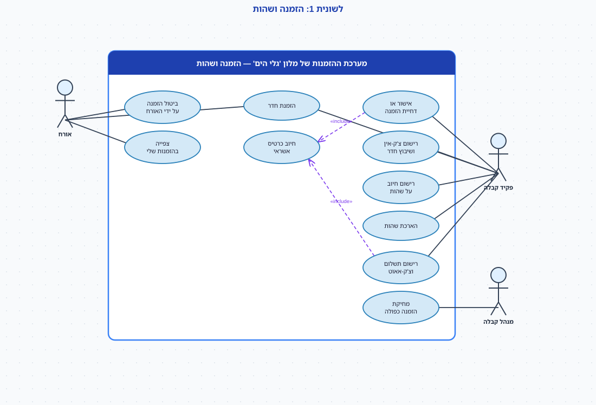
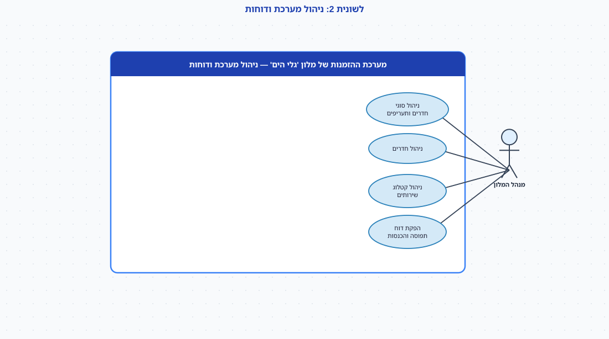
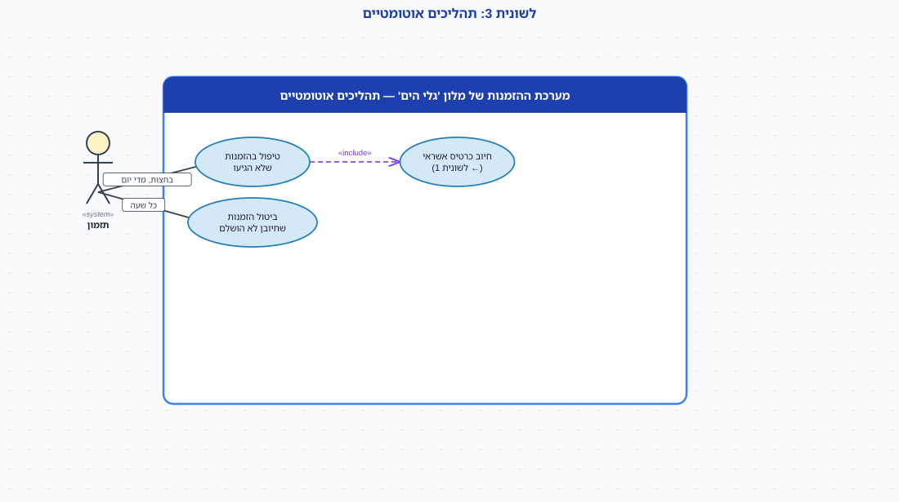
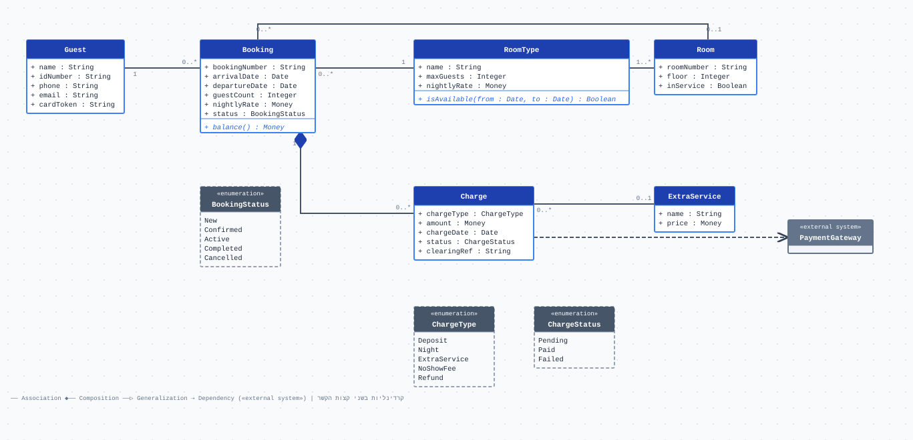

# מלון 'גלי הים' — מסמך אפיון

> מסמך אפיון עבור מערכת ההזמנות החדשה של **מלון 'גלי הים'**. המסמך מתאר את העסק, את
> המצב הקיים, את בעלי העניין וראיונות עימם, ומגבש מהם מילון נתונים וכללים עסקיים. הוא
> נכתב כקלט לשלב **העיצוב** — והפעם הבסיס לבניית **תרשים מצבים** למחזור החיים של
> **הזמנת חדר** — ובכוונה משאיר כמה החלטות מידול פתוחות: המסמך אומר מה העסק צריך,
> לא איך למדל. המסמך מסתיים ב**תרשים תרחישי השימוש** וב**תרשים המחלקות** של המערכת —
> התוצרים של השלבים הקודמים: קודם מה המערכת *עושה*, אחר כך מה היא *זוכרת*, ועכשיו —
> **איך אובייקט אחד משנה את מצבו לאורך חייו.**

---

## 1. תיאור העסק

**מלון 'גלי הים'** הוא מלון חוף עם **84 חדרים** בארבע קומות, הפועל כל השנה. החדרים
נחלקים ל**סוגי חדרים** — סטנדרט, נוף לים, סוויטה — ולכל סוג תעריף ללילה ומספר אורחים
מרבי. אורחים מזמינים **דרך אתר המלון**, בטלפון או במייל; כ-**60 הזמנות** נפתחות ביום
בעונה, ומחזור ההזמנה הוא לב העסק: הזמנה נפתחת, מאושרת, האורח מגיע, שוהה, משלם ועוזב —
או שההזמנה מתבטלת באחת מכמה דרכים.

**מבנה ארגוני.** **מנהל המלון** (תעריפים, סוגי חדרים, דוחות), **מנהל קבלה** (אחראי
על דלפק הקבלה, חריגים וביטולים), **פקידי קבלה** (שלוש עמדות — אישור הזמנות, צ'ק-אין,
צ'ק-אאוט, חיובים במהלך השהות), **הנהלת חשבונות** (שני עובדים — התאמות כרטיסי אשראי,
דיווח למס), ו**משק בית** (ניקיון והכנת חדרים — מחוץ למערכת). האורחים מזמינים בעצמם
באתר; מי שמזמין בטלפון — פקיד הקבלה מזין את ההזמנה בשמו.

## 2. ניתוח מצב קיים

היום ההזמנות מנוהלות ב**יומן הזמנות** ממוחשב ישן (טבלה אחת: אורח, תאריכים, חדר, הערות)
ובמקביל ב**מייל** ובטלפון. הבעיות שדווחו:

- **אין מצב להזמנה.** ביומן יש שדה "הערות" חופשי: "אושר", "שילם מקדמה", "לא הגיע",
  "בוטל — ביקש", "בוטל — אין חדר". אף אחד לא יודע כמה הזמנות **מאושרות** יש לסוף השבוע
  בלי לקרוא את כל ההערות, ואי-אפשר לדעת מתי הזמנה עברה ממצב למצב.
- **חיוב שנכשל נשכח.** פקיד הקבלה מאשר הזמנה, מנסה לחייב את הכרטיס, החיוב נכשל — והוא
  רושם "לחייב שוב". לפעמים שוכחים, והאורח מגיע להזמנה מאושרת שלא שולמה.
- **הזמנות כפולות.** אורחים לוחצים פעמיים ב"שלח" באתר, או מזמינים גם באתר וגם בטלפון.
  היומן מציג שתי הזמנות זהות, ואף אחת לא מסומנת ככפולה.
- **אי-הגעה מתגלה בבוקר.** אורח שלא הגיע מתגלה רק למחרת, אחרי שהחדר עמד ריק — והחיוב
  על הלילה הראשון מבוצע ידנית, אם בכלל.
- **חשבון השהות** (מיני-בר, מסעדה, חניה) נרשם על פתקים ומסוכם בצ'ק-אאוט; לפעמים אורח
  יוצא בלי לשלם תוספת שנשכחה.
- **דוח תפוסה והכנסות** מוכן ידנית פעם בשבוע.

## 3. בעלי עניין

| בעל עניין | תפקיד | מה חשוב לו |
|-----------|-------|------------|
| מנהל המלון | הנהלה | תפוסה, הכנסות, תעריפים לפי סוג חדר ועונה |
| מנהל קבלה | תפעול | חריגים: ביטולים, אי-הגעה, הזמנות כפולות, חיובים שנכשלו |
| פקידי קבלה | תפעול | לאשר הזמנה מהר, לדעת בדיוק מה מצב כל הזמנה, צ'ק-אין/אאוט בלי טעויות |
| הנהלת חשבונות | פנימי | כל חיוב וכל החזר מתועדים; שמירת רשומות לפי חוק |
| אורחים | לקוחות | להזמין ולבטל בקלות, לדעת מה מצב ההזמנה, לא להיות מחויבים בטעות |
| שער התשלום (חברת הסליקה) | מערכת חיצונית | חיוב וזיכוי כרטיסי אשראי |

## 4. ראיונות בעלי עניין

### ראיון: אורי גלעד, מנהל קבלה

> "**הזמנה** היא הדבר שאני חי איתו. אורח מזמין — באתר או דרכנו — לתאריכים, לסוג חדר,
> למספר אורחים. זו הזמנה **חדשה**. פקיד קבלה בודק אם יש חדר מהסוג הזה פנוי לכל התאריכים:
> אם כן — **מאשר**, ואם לא — **דוחה**, וההזמנה מבוטלת עם הסיבה 'אין זמינות'. באישור
> אנחנו מחייבים את הכרטיס ב**מקדמה** של לילה ראשון, דרך חברת הסליקה. אם החיוב נכשל —
> ההזמנה לא מאושרת.
>
> "מה קורה כשהחיוב נכשל? היום — כלום, וזו הבעיה. מה שאני רוצה: ההזמנה מחכה, אנחנו
> מתקשרים לאורח, מנסים כרטיס אחר, ואם תוך **24 שעות** לא הצלחנו לחייב — ההזמנה
> **מתבטלת** אוטומטית. בזמן הזה ההזמנה לא מאושרת, אבל היא גם לא בוטלה. תקראו לזה
> איך שאתם רוצים.
>
> "**ביטול** על ידי האורח — חופשי עד **48 שעות** לפני ההגעה, עם החזר מלא של המקדמה.
> אחרי זה האורח כבר לא יכול לבטל בעצמו — מבחינתנו, מי שלא מגיע הוא **אי-הגעה**: אורח
> שלא ביצע צ'ק-אין עד **חצות** ביום ההגעה, ההזמנה מתבטלת והמקדמה (הלילה הראשון)
> נשארת אצלנו. שלוש דרכים להגיע ל'בוטלה', ואני רוצה לדעת **איזו** מהן קרתה — כי
> בכל אחת הכסף מתנהג אחרת.
>
> "והזמנות כפולות: כשאני רואה שני 'שלח' של אותו אורח לאותם תאריכים, אני **מוחק** את
> הכפולה. היא לא הזמנה שבוטלה — היא מעולם לא הייתה הזמנה. אין לי שום סיבה לשמור אותה."

### ראיון: נטע ברוך, פקידת קבלה

> "**צ'ק-אין**: האורח מגיע ביום ההגעה עם הזמנה מאושרת, מציג תעודה מזהה, ואני משבצת
> לו **חדר** מהסוג שהזמין. מרגע זה ההזמנה היא **שהות פעילה**. במהלך השהות אני רושמת
> **חיובים** על ההזמנה — מיני-בר, ארוחות, חניה, כל אחד מקטלוג השירותים עם מחיר. אורח
> שרוצה **להאריך** את השהות — אם החדר פנוי לתאריכים, אני מעדכנת את תאריך היציאה; זו
> אותה שהות, לא הזמנה חדשה.
>
> "**צ'ק-אאוט**: אני מציגה את החשבון — לילות לפי התעריף, פחות המקדמה, פלוס התוספות —
> והאורח משלם את היתרה. רק אחרי שהחשבון **שולם במלואו** אני סוגרת את השהות; אורח לא
> יוצא עם יתרת חוב. אחר כך ההזמנה **הושלמה** — וזהו, היא לא משתנה יותר."

### ראיון: רו"ח דנה שלו, הנהלת חשבונות

> "מהרגע שחייבנו כרטיס — המקדמה, הלילה הראשון על אי-הגעה, החזר — ההזמנה היא **רשומה
> כספית**. לפי הוראות ניהול ספרים אנחנו שומרים רשומות כאלה **שבע שנים** מתום שנת המס.
> גם הזמנה שבוטלה עם החזר — שבע שנים, כי הייתה תנועה כספית. אל תמחקו לי שום דבר
> שעבר דרך הסליקה.
>
> "הזמנה שנדחתה כי לא היה חדר — לא חויבה מעולם. עליה אין לי דרישה. תשאלו את מנהל
> המלון כמה זמן הוא רוצה לראות אותה בדוחות."

### ראיון: יובל אשכנזי, מנהל המלון

> "אני קובע את **סוגי החדרים** ואת **התעריף ללילה** לכל סוג — והתעריף משתנה לפי עונה.
> הזמנה שאושרה שומרת את התעריף שהיה בזמן האישור. אני מנהל גם את **קטלוג השירותים
> הנוספים** ואת רשימת החדרים (חדר בשיפוץ לא משובץ).
>
> "**דוח תפוסה והכנסות** שבועי: כמה הזמנות מאושרות, כמה שהיות פעילות, כמה הושלמו,
> כמה בוטלו — ובאיזו דרך — וההכנסה. הזמנות שנדחו על חוסר זמינות מעניינות אותי מאוד:
> זה ביקוש שהפסדנו. אני רוצה לראות אותן בדוחות **לפחות שנתיים** אחורה כדי לתכנן עונות."

## 5. דרישות

### 5.1 מילון נתונים

לכל ישות: מי **הבעלים** של הנתון (🏠 המערכת שלנו · 🌐 מערכת חיצונית שאנחנו קוראים לה),
ושדותיה. המילון **מתאר עובדות עסקיות** — הוא אינו תרשים מחלקות ואינו תרשים מצבים,
וחלק מההחלטות (מה מצב, מה תכונה, מה אירוע) נשארות לשלב העיצוב.

#### 5.1.1 סוג חדר 🏠

| שדה | ערכים / פורמט | חובה | הערות |
|------|----------------|:----:|--------|
| שם | סטנדרט / נוף לים / סוויטה | ✓ | ההנהלה מוסיפה סוגים |
| מספר אורחים מרבי | מספר | ✓ | |
| תעריף ללילה | ש"ח | ✓ | משתנה לפי עונה; **נקבע להזמנה בזמן האישור** |

#### 5.1.2 חדר 🏠

| שדה | ערכים / פורמט | חובה | הערות |
|------|----------------|:----:|--------|
| מספר חדר | 101–412 | ✓ | ייחודי |
| קומה | 1–4 | ✓ | |
| סוג חדר | הפניה | ✓ | |
| זמינות | פעיל / בשיפוץ | ✓ | חדר בשיפוץ אינו משובץ |

#### 5.1.3 אורח 🏠

| שדה | ערכים / פורמט | חובה | הערות |
|------|----------------|:----:|--------|
| שם מלא | טקסט | ✓ | |
| תעודה מזהה | מספר | ✓ | נבדק בצ'ק-אין |
| טלפון / דוא"ל | | ✓ | ליצירת קשר על חיוב שנכשל |
| כרטיס אשראי | אסימון (token) | ✓ | המספר עצמו נשמר **בשער התשלום**, לא אצלנו |

#### 5.1.4 הזמנה 🏠

| שדה | ערכים / פורמט | חובה | הערות |
|------|----------------|:----:|--------|
| מספר הזמנה | מוקצה אוטומטית | ✓ | ייחודי; האורח מצטט אותו בטלפון |
| אורח | הפניה | ✓ | |
| סוג חדר מבוקש | הפניה | ✓ | החדר עצמו משובץ רק בצ'ק-אין |
| חדר משובץ | הפניה | רשות | חובה מרגע הצ'ק-אין |
| תאריך הגעה / יציאה | תאריך | ✓ | יציאה > הגעה; היציאה ניתנת להארכה במהלך השהות |
| מספר אורחים | מספר | ✓ | ≤ המרבי לסוג החדר |
| תעריף ללילה | ש"ח | ✓ | **מוקפא בזמן האישור** |
| מצב | חדשה / מאושרת / פעילה / הושלמה / בוטלה | ✓ | ראו §5.2 — המצבים שהעסק **מדבר** עליהם; לא בהכרח הרשימה הסופית |
| סיבת ביטול | דחייה — אין זמינות / ביטול על ידי האורח / אי-הגעה / תשלום נכשל | רשות | חובה כשהמצב "בוטלה" |
| תאריכי מעבר | תאריך-שעה לכל שינוי מצב | ✓ | מי ומתי (יומן) |

#### 5.1.5 חיוב 🏠 (סליקה: 🌐)

| שדה | ערכים / פורמט | חובה | הערות |
|------|----------------|:----:|--------|
| הזמנה | הפניה | ✓ | חיוב קיים רק בתוך הזמנה |
| סוג חיוב | מקדמה / לילה / שירות נוסף / דמי אי-הגעה / החזר | ✓ | החזר — סכום שלילי |
| שירות נוסף | הפניה לקטלוג | רשות | רק בסוג "שירות נוסף" |
| סכום | ש"ח | ✓ | |
| תאריך | תאריך-שעה | ✓ | |
| מצב | ממתין / שולם / נכשל | ✓ | "נכשל" — תשובת חברת הסליקה |
| אסמכתת סליקה | מחרוזת | רשות | מגיעה משער התשלום |

#### 5.1.6 שירות נוסף (קטלוג) 🏠

| שדה | ערכים / פורמט | חובה | הערות |
|------|----------------|:----:|--------|
| שם | מיני-בר / ארוחת בוקר / חניה / ספא / … | ✓ | ההנהלה משנה את הרשימה |
| מחיר | ש"ח | ✓ | |

### 5.2 כללים עסקיים (BR)

| # | כלל |
|---|-----|
| **BR-1** | הזמנה מאושרת רק אם קיים חדר **פנוי** מהסוג המבוקש לכל לילות השהות (ולא בשיפוץ). |
| **BR-2** | באישור מחויבת **מקדמה** של לילה ראשון. חיוב שנכשל — ההזמנה אינה מאושרת; אם לא הצליח חיוב תוך **24 שעות**, ההזמנה מתבטלת. |
| **BR-3** | האורח רשאי לבטל **עד 48 שעות** לפני יום ההגעה, בהחזר מלא של המקדמה. לאחר מכן — אינו רשאי לבטל. |
| **BR-4** | אורח שלא ביצע צ'ק-אין **עד חצות** ביום ההגעה — ההזמנה מתבטלת כאי-הגעה, והמקדמה נשארת במלון. |
| **BR-5** | צ'ק-אין רק להזמנה **מאושרת**, ביום ההגעה, עם תעודה מזהה ושיבוץ חדר מהסוג שהוזמן. |
| **BR-6** | הארכת שהות מותרת רק במהלך שהות פעילה, ורק אם החדר פנוי לתאריכים הנוספים. |
| **BR-7** | צ'ק-אאוט רק לאחר שיתרת החשבון **שולמה במלואה**. |
| **BR-8** | הזמנה שהושלמה או בוטלה אינה ניתנת לשינוי; היא נשמרת לצורכי דיווח. |
| **BR-9** | הזמנה שעברה דרכה תנועה כספית (מקדמה, החזר, דמי אי-הגעה) נשמרת **7 שנים** מתום שנת המס (הוראות ניהול ספרים). |
| **BR-10** | הזמנה כפולה (אותו אורח, אותם תאריכים, אותו סוג חדר, שטרם אושרה) **נמחקת** על ידי מנהל הקבלה — אינה נחשבת להזמנה שבוטלה. |
| **BR-11** | התעריף ללילה מוקפא בהזמנה בזמן האישור ואינו משתנה גם אם התעריף העונתי השתנה. |

### 5.3 דוחות ושאילתות שהעסק מבקש

- **דוח תפוסה והכנסות** שבועי: הזמנות לפי מצב, ביטולים לפי סיבה, הכנסה לפי סוג חדר.
- **הגעות היום**: ההזמנות המאושרות ליום זה, ומי מהן טרם ביצע צ'ק-אין.
- **הזמנות ממתינות לחיוב**: הזמנות שהחיוב בהן נכשל וטרם עברו 24 שעות.
- **חשבון שהות**: כל החיובים על הזמנה, היתרה לתשלום.
- **ביקוש שהפסדנו**: הזמנות שנדחו על חוסר זמינות, לפי תאריך וסוג חדר — שנתיים אחורה.
- **היסטוריית אורח**: כל ההזמנות של אורח, כולל ביטולים ואי-הגעות.

### 5.4 דרישות לא-פונקציונליות (תמצית)

- כל שינוי מצב של הזמנה נרשם עם מי, מתי ולמה (יומן ביקורת) — **גם** שינוי אוטומטי.
- הודעה לאורח (דוא"ל / SMS) באישור, בביטול מכל סיבה, ובחיוב שנכשל.
- פרטי כרטיס האשראי אינם נשמרים במערכת — רק אסימון של שער התשלום.
- שמירת רשומות: כאמור ב-BR-9; הזמנות שלא חויבו מעולם — לפי החלטת ההנהלה (שאלה פתוחה 3).
- זמינות 24/7 (צ'ק-אין מאוחר, תהליכי חצות); כל פעולה בדלפק פחות מ-3 שניות.

## 6. תרשים תרחישי שימוש — התוצר של שלב הניתוח

התרשים אומר **מה המערכת עושה ובשביל מי**. לתרשים המצבים הוא חשוב מסיבה אחרת: **כל אירוע**
שמעביר הזמנה ממצב למצב חייב להגיע **מתרחיש שימוש כלשהו** (או מאירוע זמן) — אישור, ביטול,
צ'ק-אין, צ'ק-אאוט, אי-הגעה. אירוע בתרשים המצבים שאף תרחיש לא מפעיל — חשוד; תרחיש שמשנה
מצב ולא מופיע בתרשים המצבים — חסר. הגרסה האינטראקטיבית (לחיצה על תרחיש פותחת את זרימת
האירועים ואת המסך): [תרשים-תרחישי-שימוש-מלון.html](תרשים-תרחישי-שימוש-מלון.html).

**לשונית 1 — הזמנה ושהות**

**לשונית 2 — ניהול מערכת ודוחות**

**לשונית 3 — תהליכים אוטומטיים**

| # | תרחיש שימוש | שחקן יוזם | הערות |
|---|-------------|-----------|-------|
| 1 | הזמנת חדר | אורח · פקיד קבלה | הזמנה **חדשה**; פקיד הקבלה מזין בשם מי שהזמין בטלפון |
| 2 | ביטול הזמנה על ידי האורח | אורח | רק עד 48 שעות לפני ההגעה (BR-3); החזר מקדמה |
| 3 | צפייה בהזמנות שלי | אורח | |
| 4 | אישור או דחיית הזמנה | פקיד קבלה | «include» חיוב כרטיס אשראי; דחייה ⇐ בוטלה עם סיבה |
| 5 | חיוב כרטיס אשראי | — (מוכלל) | קריאה לשער התשלום; מקדמה / יתרה / דמי אי-הגעה |
| 6 | רישום צ'ק-אין ושיבוץ חדר | פקיד קבלה | הזמנה ⇐ **פעילה** |
| 7 | רישום חיוב על שהות | פקיד קבלה | שירות נוסף מהקטלוג |
| 8 | הארכת שהות | פקיד קבלה | אותה הזמנה; רק אם החדר פנוי |
| 9 | רישום תשלום וצ'ק-אאוט | פקיד קבלה | «include» חיוב כרטיס אשראי; ⇐ **הושלמה** רק אחרי תשלום מלא |
| 10 | מחיקת הזמנה כפולה | מנהל קבלה | מחיקה — לא ביטול (BR-10) |
| 11–13 | ניהול סוגי חדרים ותעריפים · ניהול חדרים · ניהול קטלוג שירותים | מנהל המלון | |
| 14 | הפקת דוח תפוסה והכנסות | מנהל המלון | |
| 15 | טיפול בהזמנות שלא הגיעו | ⏰ תזמון (חצות) | «include» חיוב כרטיס אשראי (דמי אי-הגעה); ⇐ **בוטלה** |
| 16 | ביטול הזמנות שחיובן לא הושלם | ⏰ תזמון (כל שעה) | 24 שעות מהניסיון הראשון (BR-2); ⇐ **בוטלה** |

> **שימו לב:** שער התשלום (חברת הסליקה) **אינו שחקן** — אנחנו קוראים לו, הוא לא יוזם.
> בתרשים המחלקות הוא מופיע כ-«external system» עם קשר **תלות**. ושימו לב לשני תרחישי
> **הזמן**: אירוע `after(…)` בתרשים המצבים חייב שיהיה מי שמפעיל אותו.

## 7. תרשים המחלקות (תוצר הרצאות 6–7)

זהו מודל התחום של המערכת — הקלט לתרשים המצבים: תרשים המצבים מצויר עבור המחלקה
`Booking`, ותכונת המצב שלה היא `status : BookingStatus`. שימו לב שה-enum בתרשים מונה חמישה
ערכים — בדיוק מה שהעסק *מדבר* עליו בסעיף 5.1.4. האם זו הרשימה הסופית? זו בדיוק השאלה
שתרשים המצבים עונה עליה, ואת התשובה מחזירים לכאן. הגרסה האינטראקטיבית:
[תרשים-מחלקות-מלון.html](תרשים-מחלקות-מלון.html).

## 8. הנחות, גבולות ושאלות פתוחות

- **מחוץ לגבול המערכת:** סליקת האשראי (שער התשלום), משק הבית והכנת החדרים, הזמנות
  קבוצתיות וסוכני נסיעות, וחשבונאות המלון עצמה (המערכת מייצאת אליה תנועות).
- **הנחה:** הזמנה היא לסוג חדר; חדר ספציפי משובץ רק בצ'ק-אין. "חדר פנוי" באישור =
  מספר ההזמנות המאושרות/הפעילות לסוג בכל לילה קטן ממספר החדרים הפעילים מהסוג.
- **הנחה:** הארכת שהות משנה את תאריך היציאה של אותה הזמנה — לא פותחת הזמנה חדשה.
- **שאלה פתוחה 1 — "ממתינה לתשלום":** בין ניסיון החיוב שנכשל לביטול אחרי 24 שעות —
  האם זה **מצב** של ההזמנה, או רק תכונה על "חדשה"/"מאושרת"? אילו אירועים ההזמנה מקבלת
  בזמן הזה (ניסיון חיוב חוזר, חלוף 24 שעות) שהיא אינה מקבלת במצבים האחרים? מבחן ההתנהגות
  מכריע — לשני הכיוונים, **עם נימוק**.
- **שאלה פתוחה 2 — דחייה:** הזמנה שנדחתה על חוסר זמינות — "בוטלה" עם סיבה, או מצב
  תוצאה נפרד ("נדחתה")? מה מנהל המלון צריך כדי להפיק את דוח "ביקוש שהפסדנו"?
- **שאלה פתוחה 3 — כמה זמן שומרים:** הנהלת החשבונות דורשת 7 שנים לכל הזמנה שחויבה;
  הזמנה שנדחתה ולא חויבה מעולם — מנהל המלון רוצה אותה בדוחות שנתיים. האם לזנב הארכיון
  יש תקופה אחת, או שתיים? ומה עם ההזמנה הכפולה שנמחקה?
- **שאלה פתוחה 4 — אחרי החלון:** אורח שמבקש לבטל 24 שעות לפני ההגעה — מה קורה במערכת?
  (רמז: כלל עסקי שאומר "אסור" הוא חץ **שחסר**, לא חץ עם "לא".)
