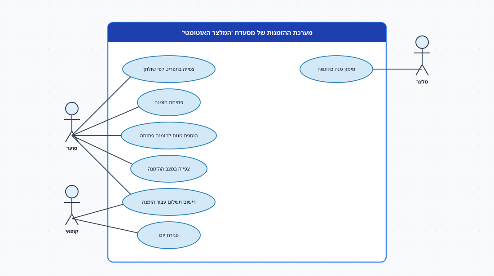
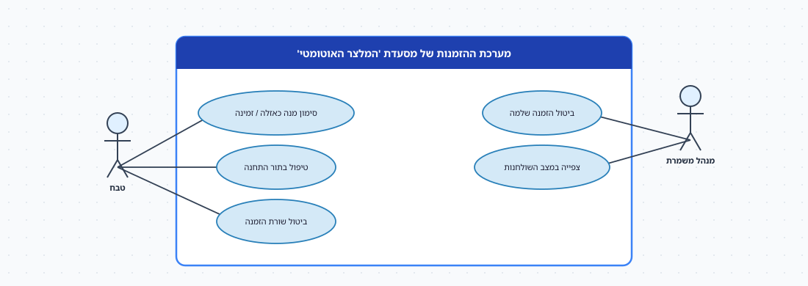
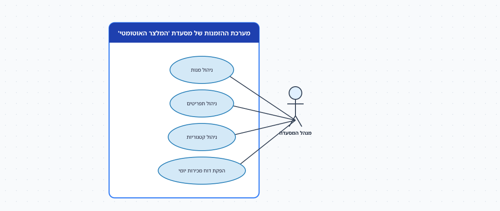

# מסעדת 'המלצר האוטומטי' — מסמך אפיון

> מסמך אפיון עבור מערכת ההזמנות החדשה של מסעדת **'המלצר האוטומטי'**. המסמך מתאר את
> העסק, את המצב הקיים, את בעלי העניין וראיונות עימם, ומגבש מהם מילון נתונים וכללים
> עסקיים. הוא נכתב כקלט לשלב **העיצוב** — הבסיס לבניית **תרשים מחלקות** (מודל תחום) —
> ובכוונה משאיר כמה החלטות מידול פתוחות: המסמך אומר מה העסק צריך, לא איך למדל.
> המסמך מסתיים ב**תרשים תרחישי השימוש** של המערכת — התוצר של שלב הניתוח, והקלט השני
> (לצד המסמך) לבניית תרשים המחלקות: קודם מה המערכת *עושה*, אחר כך מה היא צריכה *לזכור*.

---

## 1. תיאור העסק

**'המלצר האוטומטי'** היא מסעדה עם **32 שולחנות** באולם ובחצר, הפועלת שבעה ימים בשבוע
בשתי משמרות (צהריים וערב). המסעדה מגישה תפריט משולב, והמטבח מחולק ל**שלוש תחנות
הכנה**: **בשרית**, **חלבית** ו**קינוחים** — לכל תחנה מסך משלה, טבח אחראי ותור הזמנות
משלה. הרעיון העסקי: הסועד **מזמין בעצמו מהטלפון** — סורק קוד QR שעל השולחן, רואה את
התפריט, מזמין, מוסיף מנות במהלך הארוחה, ומשלם — והמלצרים מתפנים להגשה ולשירות.

**מבנה ארגוני.** **מנהל/ת המסעדה** (תפריט, מחירים, דוחות), **מנהל/ת משמרת** (השולחנות,
פתרון בעיות, ביטולים), **טבחים** (אחד אחראי לכל תחנה), **מלצרים** (הגשה ופינוי) ו**קופאי/ת**
(תשלומים במזומן, סגירת יום). כ-**450 סועדים** ביום בממוצע, עד 700 בסופי שבוע.

## 2. ניתוח מצב קיים

היום ההזמנה נרשמת על ידי מלצר ב**מסופון** ישן, מודפסת במטבח על **פתקים** לפי תחנה,
והחשבון מחושב בקופה. הבעיות:

- **מנה שאזלה** ממשיכה להופיע בתפריט; המלצר מגלה זאת רק כשהפתק חוזר מהמטבח.
- **הזמנה אחת, שלושה פתקים.** מנות של שולחן אחד מתפזרות בין שלוש התחנות, ואף אחד
  לא רואה את התמונה המלאה: מה כבר הוגש ומה עוד בהכנה.
- **הערות** ("בלי בצל", "אלרגיה לאגוזים") נכתבות ביד ולא תמיד מגיעות לתחנה הנכונה.
- **כמה סועדים משלמים בנפרד** על אותו שולחן — והקופה לא יודעת לחלק חשבון.
- **דוח המכירות היומי** מוכן ידנית מפתקי הקופה; ההנהלה לא יודעת איזו מנה נמכרת הכי
  הרבה, או מה זמן ההכנה הממוצע בתחנה הבשרית בערב שישי.

## 3. בעלי עניין

| בעל עניין | תפקיד | מה חשוב לו/לה |
|-----------|-------|----------------|
| מנהל/ת המסעדה | הנהלה | תפריט ומחירים, דוח מכירות, מנות פופולריות |
| מנהל/ת משמרת | תפעול | מצב כל שולחן, ביטולים, בעיות |
| טבחים (לפי תחנה) | תפעול | תור ברור לתחנה שלי, הערות ברורות, לסמן "מוכן" |
| מלצרים | תפעול | מה מוכן להגשה ולאיזה שולחן |
| קופאי/ת | תפעול | חשבון נכון, חלוקה בין סועדים, סגירת יום |
| סועדים | לקוחות | תפריט עדכני, להזמין ולהוסיף בקלות, לשלם בנפרד |
| חברת הסליקה | מערכת חיצונית | תשלומי כרטיס אשראי |

## 4. ראיונות בעלי עניין

### ראיון: עידו לוי, מנהל המסעדה

> "התפריט הוא הלב. לכל **מנה** יש שם, תיאור, מחיר, ותחנה שמכינה אותה — מנה אחת שייכת
> תמיד לתחנה אחת. יש לנו **תפריט צהריים** ו**תפריט ערב**, ומנות רבות מופיעות בשניהם
> (לפעמים במחיר שונה). יש גם **קטגוריות** להצגה — ראשונות, עיקריות, שתייה, קינוחים —
> ואני משנה אותן מדי פעם.
>
> "כשמנה **אזלה** באמצע המשמרת, אני רוצה שהטבח ילחץ כפתור והיא תיעלם מהתפריט של
> הסועדים באותו רגע. ובסוף היום: **דוח מכירות** — כמה הזמנות, סכום כולל, פילוח לפי
> תחנה, ועשר המנות הנמכרות ביותר."

### ראיון: שירה אביטל, מנהלת משמרת

> "לכל **שולחן** יש מספר וקוד QR קבוע. סועדים מתיישבים, סורקים, ומתחילים **הזמנה**.
> ההזמנה שייכת לשולחן, אבל השולחן מתחלף — בערב עמוס אותו שולחן מארח ארבע קבוצות
> שונות. אני צריכה לדעת מה ההזמנה הפתוחה **עכשיו** בשולחן 12, וגם לראות מה קרה
> בשולחן 12 לאורך הערב.
>
> "בהזמנה אחת סועד בוחר מנות **בכמויות** — 'שתי המבורגר, קולה אחת' — ולכל שורה אפשר
> להוסיף **הערה**: בלי בצל, מדיום. ואז, באמצע הארוחה, מוסיפים קינוחים — אותה הזמנה,
> עוד שורות. **מצב ההזמנה**: התקבלה / בהכנה / הוגשה / שולמה, ולפעמים **בוטלה** — ואז
> אני חייבת לרשום למה. ביטול של **שורה בודדת** — כן, קורה, אם המנה אזלה אחרי שהוזמנה."

### ראיון: דודו מזרחי, טבח אחראי — תחנה בשרית

> "אני רואה במסך רק את מה ששייך **לתחנה שלי**: שורות ההזמנה של מנות בשריות, לפי סדר
> הגעה, עם הכמות וההערות. כשאני מתחיל — מסמן 'בהכנה'; כשמוכן — 'מוכן להגשה', והמלצר
> רואה. הזמנה של שולחן יכולה להיות מפוצלת: הסלט אצל החלבי, הסטייק אצלי. ההזמנה
> כולה 'הוגשה' רק כשכל השורות הוגשו."

### ראיון: רותם פרץ, קופאית

> "בסוף הארוחה משלמים. לפעמים אחד משלם הכל, לפעמים **שלושה משלמים בנפרד** — כל אחד
> את המנות שלו או חלוקה שווה. אז להזמנה אחת יכולים להיות **כמה תשלומים**, בכרטיס
> (דרך חברת הסליקה) או במזומן. ההזמנה 'שולמה' רק כשסך התשלומים מכסה את הסכום.
> טיפ נרשם בנפרד. וסגירת יום — סכום כל התשלומים לפי אמצעי."

## 5. דרישות

### 5.1 מילון נתונים

לכל ישות: מי **הבעלים** של הנתון (🏠 המערכת שלנו · 🌐 מערכת חיצונית שאנחנו קוראים לה),
ושדותיה. המילון **מתאר עובדות עסקיות** — הוא אינו תרשים מחלקות, וחלק מההחלטות
(מה מחלקה, מה תכונה, מה רשימת ערכים, מה קשר) נשארות לשלב העיצוב.

#### 5.1.1 שולחן 🏠

| שדה | ערכים / פורמט | חובה | הערות |
|------|----------------|:----:|--------|
| מספר שולחן | 1–32 | ✓ | ייחודי |
| קוד QR | מחרוזת | ✓ | קבוע לשולחן |
| אזור | אולם / חצר | ✓ | |
| מספר מקומות | מספר | ✓ | |

#### 5.1.2 מנה 🏠

| שדה | ערכים / פורמט | חובה | הערות |
|------|----------------|:----:|--------|
| קוד מנה | מוקצה | ✓ | ייחודי |
| שם | טקסט | ✓ | |
| תיאור | טקסט | רשות | |
| מחיר בסיס | ש"ח | ✓ | ייתכן מחיר שונה בתפריט מסוים |
| תחנת הכנה | בשרית / חלבית / קינוחים | ✓ | **אחת בלבד** לכל מנה |
| קטגוריה | ראשונות / עיקריות / שתייה / קינוחים / … | ✓ | ההנהלה משנה את הרשימה |
| זמינות | זמינה / אזלה | ✓ | הטבח משנה במהלך המשמרת |
| אלרגנים | רשימה | רשות | |

#### 5.1.3 תפריט 🏠

| שדה | ערכים / פורמט | חובה | הערות |
|------|----------------|:----:|--------|
| שם | צהריים / ערב / … | ✓ | |
| שעות תוקף | מ–עד | ✓ | |
| מנות בתפריט | רשימה | ✓ | מנה יכולה להופיע בכמה תפריטים, לפעמים במחיר שונה |

#### 5.1.4 תחנת הכנה 🏠

| שדה | ערכים / פורמט | חובה | הערות |
|------|----------------|:----:|--------|
| שם | בשרית / חלבית / קינוחים | ✓ | |
| טבח אחראי במשמרת | הפניה | רשות | משתנה לפי משמרת |
| מסך | מזהה מסך | ✓ | |

#### 5.1.5 הזמנה 🏠

| שדה | ערכים / פורמט | חובה | הערות |
|------|----------------|:----:|--------|
| מספר הזמנה | מוקצה | ✓ | ייחודי |
| שולחן | הפניה | ✓ | |
| זמן פתיחה | תאריך-שעה | ✓ | |
| מצב | התקבלה / בהכנה / הוגשה / שולמה / בוטלה | ✓ | |
| סיבת ביטול | טקסט | רשות | חובה בביטול |
| סכום כולל | ש"ח | — | **מחושב** משורות ההזמנה |

#### 5.1.6 שורת הזמנה 🏠

| שדה | ערכים / פורמט | חובה | הערות |
|------|----------------|:----:|--------|
| הזמנה | הפניה | ✓ | שורה קיימת רק בתוך הזמנה |
| מנה | הפניה | ✓ | |
| כמות | מספר > 0 | ✓ | |
| מחיר ליחידה | ש"ח | ✓ | **נשמר בזמן ההזמנה** — המחיר בתפריט עלול להשתנות אחר כך |
| הערה | טקסט | רשות | "בלי בצל" |
| מצב | ממתינה / בהכנה / מוכנה / הוגשה / בוטלה | ✓ | מנוהל על ידי התחנה |

#### 5.1.7 תשלום 🏠 (סליקה: 🌐)

| שדה | ערכים / פורמט | חובה | הערות |
|------|----------------|:----:|--------|
| הזמנה | הפניה | ✓ | להזמנה **כמה** תשלומים |
| סכום | ש"ח | ✓ | |
| טיפ | ש"ח | רשות | |
| אמצעי | כרטיס אשראי / מזומן | ✓ | |
| אסמכתת סליקה | מחרוזת | רשות | רק בכרטיס — מגיעה מחברת הסליקה |
| זמן | תאריך-שעה | ✓ | |

#### 5.1.8 עובד 🏠

| שדה | ערכים / פורמט | חובה | הערות |
|------|----------------|:----:|--------|
| מספר עובד | | ✓ | ייחודי |
| שם | טקסט | ✓ | |
| תפקיד | מנהל / מנהל משמרת / טבח / מלצר / קופאי | ✓ | עובד יכול להיות טבח בערב ומלצר בצהריים |

### 5.2 כללים עסקיים (BR)

| # | כלל |
|---|-----|
| **BR-1** | לכל שולחן — לכל היותר **הזמנה פתוחה אחת** בכל רגע. |
| **BR-2** | מנה שייכת לתחנת הכנה **אחת** בלבד; שורת ההזמנה מוצגת רק במסך התחנה של המנה שלה. |
| **BR-3** | מנה במצב "אזלה" אינה ניתנת להזמנה; שורות שכבר הוזמנו — הטבח מבטל אותן עם סיבה. |
| **BR-4** | מחיר השורה נקבע בזמן ההזמנה ואינו משתנה גם אם התפריט עודכן. |
| **BR-5** | הזמנה עוברת ל"הוגשה" רק כשכל השורות (שלא בוטלו) הוגשו. |
| **BR-6** | הזמנה עוברת ל"שולמה" רק כשסך התשלומים ≥ סכום ההזמנה. |
| **BR-7** | ביטול הזמנה שלמה — רק על ידי מנהל/ת משמרת, עם סיבה. |
| **BR-8** | אפשר להוסיף שורות להזמנה כל עוד היא לא "שולמה" ולא "בוטלה". |
| **BR-9** | תשלום בכרטיס מאושר רק לאחר תשובה חיובית מחברת הסליקה. |

### 5.3 דוחות ושאילתות שהעסק מבקש

- **דוח מכירות יומי**: מספר הזמנות, סכום כולל, פילוח לפי תחנה ולפי אמצעי תשלום, עשר
  המנות הנמכרות ביותר.
- **תור תחנה**: השורות הממתינות/בהכנה בתחנה, לפי זמן.
- **מצב שולחן**: ההזמנה הפתוחה עכשיו, ומה כבר הוגש.
- **היסטוריית שולחן** במשמרת: כל ההזמנות שנפתחו בו.
- **זמן הכנה ממוצע** לפי תחנה ולפי שעה.

### 5.4 דרישות לא-פונקציונליות (תמצית)

- מסך התחנה מתעדכן תוך 2 שניות מרגע ההזמנה.
- תפריט הסועד מציג רק מנות זמינות **ברגע הצפייה**.
- כל שינוי מצב בהזמנה או בשורה נרשם עם מי ומתי.
- פעולה במערכת אינה תלויה בזמינות חברת הסליקה, למעט אישור תשלום בכרטיס.

## 6. תרשים תרחישי שימוש — התוצר של שלב הניתוח

זהו הקלט השני לבניית תרשים המחלקות, לצד המסמך. הוא אומר **מה המערכת עושה ובשביל מי**;
תרשים המחלקות צריך לתת לה את כל מה שהיא חייבת **לזכור** כדי לבצע את התרחישים האלה —
ולא יותר. מחלקה שאף תרחיש אינו זקוק לה — חשודה. הגרסה האינטראקטיבית (לחיצה על תרחיש
פותחת את זרימת האירועים ואת המסך): [restaurant-usecase.html](תרשים-תרחישי-שימוש-מסעדה.html).

**לשונית 1 — הזמנה, הגשה ותשלום**

**לשונית 2 — מטבח ומשמרת**

**לשונית 3 — ניהול מערכת**

| # | תרחיש שימוש | שחקן יוזם | הערות |
|---|-------------|-----------|-------|
| 1 | צפייה בתפריט לפי שולחן | סועד | סריקת QR; רק מנות זמינות |
| 2 | פתיחת הזמנה | סועד | מנות בכמויות, הערה לכל שורה |
| 3 | הוספת מנות להזמנה פתוחה | סועד | |
| 4 | צפייה במצב ההזמנה | סועד | |
| 5 | רישום תשלום עבור הזמנה | קופאי · סועד | מזומן / כרטיס (חברת סליקה); פיצול בין כמה סועדים |
| 6 | סגירת יום | קופאי | |
| 7 | סימון מנה כהוגשה | מלצר | |
| 8 | סימון מנה כאזלה / זמינה | טבח | |
| 9 | טיפול בתור התחנה | טבח | התחלת הכנה, מוכן להגשה |
| 10 | ביטול שורת הזמנה | טבח | עם סיבה |
| 11 | ביטול הזמנה שלמה | מנהל משמרת | עם סיבה |
| 12 | צפייה במצב השולחנות | מנהל משמרת | |
| 13–15 | ניהול מנות · ניהול תפריטים · ניהול קטגוריות | מנהל המסעדה | המחיר הוא שדה של מנה / מנה-בתפריט |
| 16 | הפקת דוח מכירות יומי | מנהל המסעדה | |

> **שימו לב:** חברת הסליקה **אינה שחקן** — אנחנו קוראים לה, היא לא יוזמת. בתרשים המחלקות
> היא תופיע כ-«external system» עם קשר **תלות**, לא כמחלקת תחום (הרצאה 6–7, שקף התלות).

## 7. הנחות, גבולות ושאלות פתוחות

- **מחוץ לגבול המערכת:** סליקת האשראי, ניהול המלאי במטבח (חומרי גלם), ושכר העובדים.
- **שאלה פתוחה 1:** "תחנת הכנה" — האם זו רשימת ערכים על המנה, או דבר שיש לו תור,
  מסך וטבח? מה קורה כשהמסעדה פותחת תחנת "בר" רביעית?
- **שאלה פתוחה 2:** "תפריט" מול "מנה" — מנה מופיעה בכמה תפריטים, לפעמים במחיר שונה.
  איפה חי המחיר של מנה **בתפריט הערב**?
- **שאלה פתוחה 3:** ההזמנה שייכת לשולחן, אבל השולחן מארח כמה קבוצות בערב. מה מזהה
  "ביקור"? האם צריך דבר כזה במודל?
- **שאלה פתוחה 4:** להזמנה יש **מצב** וגם לכל שורה יש **מצב**. האם שניהם נחוצים, ומה
  הקשר ביניהם (BR-5)?
- **שאלה פתוחה 5:** דוח המכירות היומי — מה במודל צריך להתקיים כדי להפיק אותו, ומה לא?
- **הנחה:** סועד אינו נרשם למערכת ואינו מזוהה — ההזמנה מזוהה לפי השולחן בלבד.
